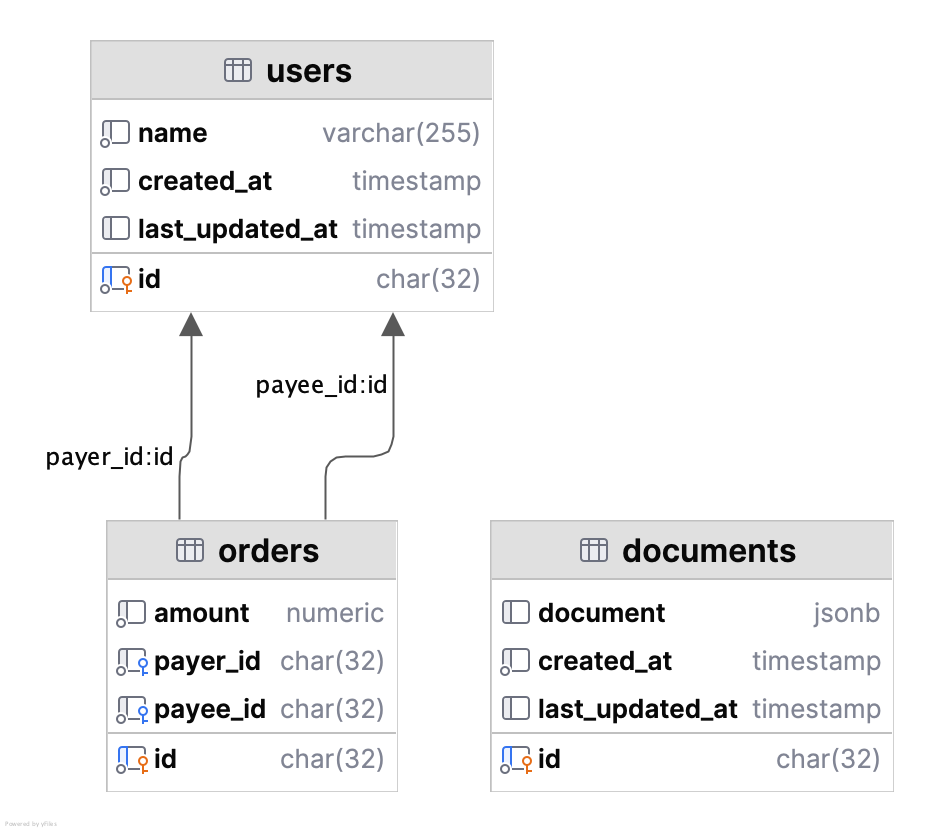

# FastAPI & PostgreSQL

[FastAPI](https://fastapi.tiangolo.com/) typically connects to an SQL database
like [PostgreSQL](https://www.postgresql.org/), a powerful and widely used choice.
This repository demonstrates how to integrate 2 popular **async PostgreSQL libraries** into FastAPI efficiently:

- [psycopg3](https://www.psycopg.org/psycopg3/docs/) (async)
- [SQLAlchemy 2.0](https://docs.sqlalchemy.org/en/20/) (async)

**Features**:

- **Database Transaction Handling**: Automatic commits & rollbacks using FastAPI's dependency injection system & context
  managers.
- **Pagination**: Basic limit offset pagination.
- **Sorting**: Multi-column sorting via query parameters: `?order_by=+[attr]` for ascending order and
  `?order_by=-[attr]`
  for descending order (compatible with OpenAPI).
- **Filtering**: TODO
- **Testing**: Unit tests.

## Getting started

- [Run PostgreSQL in a docker container](https://medium.com/@okpo65/mastering-postgresql-with-docker-a-step-by-step-tutorial-caef03ab6ae9):

```bash
make start-db
```

- Create the (empty) tables by executing the SQL statements in [db/schema.sql](db/schema.sql).



### FastAPI with psycopg

Go to [app_psycopg](src/app_psycopg)

**Resources**:

- https://blog.danielclayton.co.uk/posts/database-connections-with-fastapi/

### FastAPI with SQLAlchemy (async)

Go to [app_sqlalchemy](src/app_sqlalchemy)

**Resources**:

- https://chaoticengineer.hashnode.dev/fastapi-sqlalchemy
- https://medium.com/@tclaitken/setting-up-a-fastapi-app-with-async-sqlalchemy-2-0-pydantic-v2-e6c540be4308
- https://medium.com/@navinsharma9376319931/mastering-fastapi-crud-operations-with-async-sqlalchemy-and-postgresql-3189a28d06a2
- https://github.com/ThomasAitken/demo-fastapi-async-sqlalchemy/tree/main

## Other Resources

- Comparison between psycopg & asyncpg: https://fernandoarteaga.dev/blog/psycopg-vs-asyncpg/
- Best Practices API design: https://www.speakeasy.com/api-design

## TODO

- [ ] Add filters
